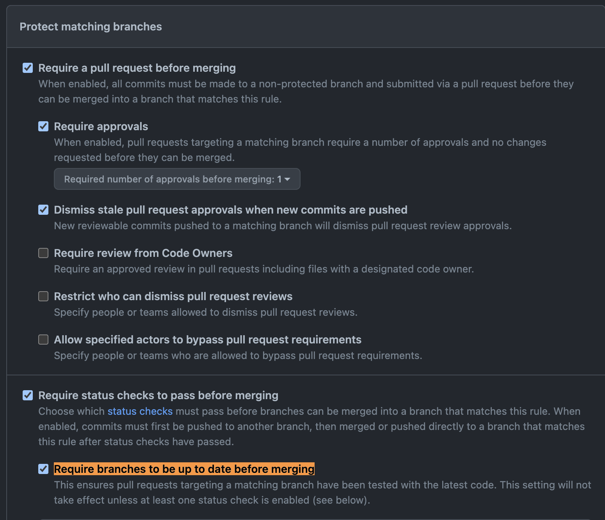

## Deployment Flow

The CI/CD flow in this repository is based on github-flow.

This is a brief introduction to github-flow.

1. create a feature branch with main as the base.
2. create a pull request from the feature branch to the main branch.
3. deploy to Production as soon as it is merged into main.

Ideally, the main branch should be ready to be deployed at any time.

This repository is triggered by the publish of the release.

1. Create <image:hash> when you push to a feature.
2. Create <image:hash> to create <image:latest> when you push to main.
3. The release will be created or updated when you push it to main.
4. Deploy <image:latest> in the production environment after 3.
5. Create <image:latest> to create <image:release-version> when you publish release.
6. Deploy <image:release-version> in the production environment after 5.

## Release Note

There is a checked and not yet section in the release note.
If the target repository has a checked label, it will appear in the checked section; if not, it will appear in the not yet section.

## About Testing

Testing, static analysis, etc. is only done when you push to a feature branch.
In the past, testing would be done after the merge to ensure that the branch is not broken.
However, by enabling "Require branches to be up to date before merging" in Protected Branch, you can ensure that the feature branch follows the base, main, when it is merged.

## Issue

- Anyone can create a release.
- Anyone can publish at any time.